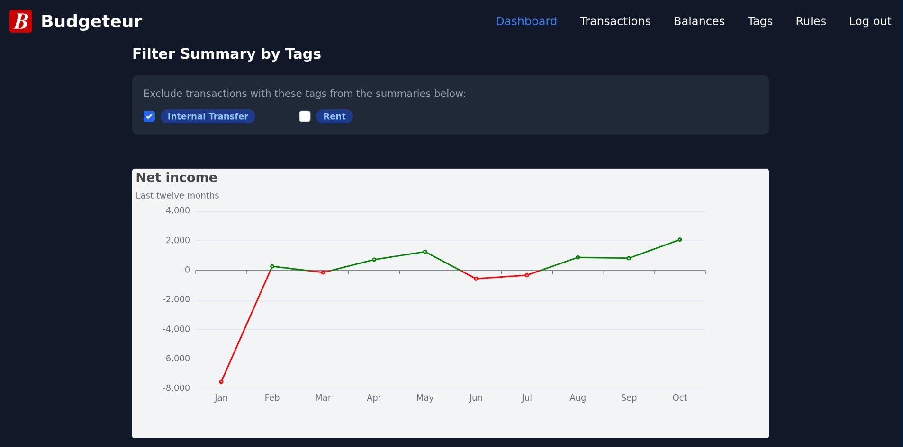

# Budgeteur

[](https://github.com/AnthonyDickson/budgeteur-rs/actions/workflows/ci.yml)
[](https://github.com/AnthonyDickson/budgeteur-rs/actions/workflows/release.yaml)

## About

Budgeteur is a budgeting and personal finance web-app.

This app aims to provide two services:

- Budgeting: Recording your income and expenses, and tracking savings targets.
- Personal Finance: Keeping track of your net worth.

This application is intended for a single user and to be self-hosted on a home server.



## Why?

I started budgeting with a phone app, but I quickly ran into three main issues:

1. it required me to enter my income/expenses manually,
1. it only worked on my phone,
1. and it didn't help me with tracking my net worth.

I have tried using a spreadsheet to track my net worth, however I then ran into issues where editing this spreadsheet
from multiple devices lead to old copies overwriting the copy in my cloud storage.

Budgeteur is my attempt at a single, cross-platform application for tracking my budget and net worth.
One helpful feature of Budgeteur is that you can import transactions and track your account balances from CSV files.
These CSV can be exported from the internet banking websites for New Zealand bank accounts (ASB and Kiwibank).
This reduces the amount manual data entry significantly, making it easier to maintain the habit of tracking your
budget even when life gets busy.

## Getting Started

This application is distributed as a Docker image and Docker Compose is the recommended way of running the app.

See [compose.yaml](./compose.yaml) for an example Docker compose file.

Once you have your `compose.yaml` set up, just run:

```shell
docker compose up
```

> [!CAUTION]
> The server uses HTTP which is not secure. It is highly recommended to put the
> server behind a reverse proxy such as Nginx to serve the application over
> HTTPS, especially if hosting this app on the public internet.

### First-Time Usage

Navigate to `https://<published URL>/register` and create a user account.

### Resetting Your Password

Run the following command:

```shell
docker compose -p budgeteur exec web reset_password --db-path /app/data/budgeteur.db
```

> [!TIP]
> Refer to your `compose.yaml` for the host mount path, database filename and/or image tag.

The app only allows a single user and the following instructions will reset
the password for that sole user account.

## Dates and Timezones

The app will use, in order of priority, dates and times in:

1. the timezone specified in the CLI flags or
1. the local timezone as specified by the host operating system or
1. the UTC+00:00 timezone if the host operating system's local timezone cannot be determined.

The app will assume all dates and times from the web client use the timezone as determined above.
The CLI will accept canonical timezones as specified in <https://en.wikipedia.org/w/index.php?title=List_of_tz_database_time_zones&oldid=1309592143#List>,
e.g. "Pacific/Auckland".

## Development

If you are interested in compiling and/or modifying the source code, see [DOCS.md](/DOCS.md).
