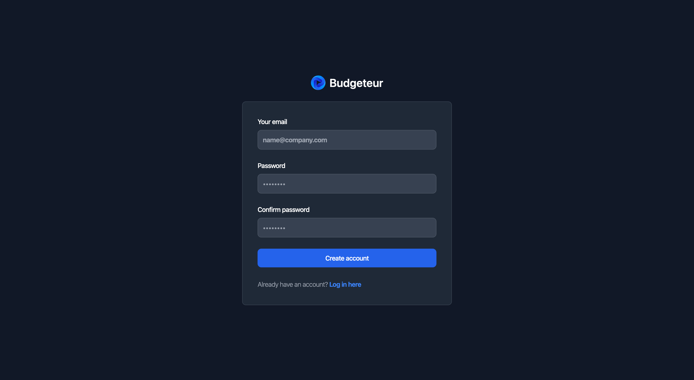
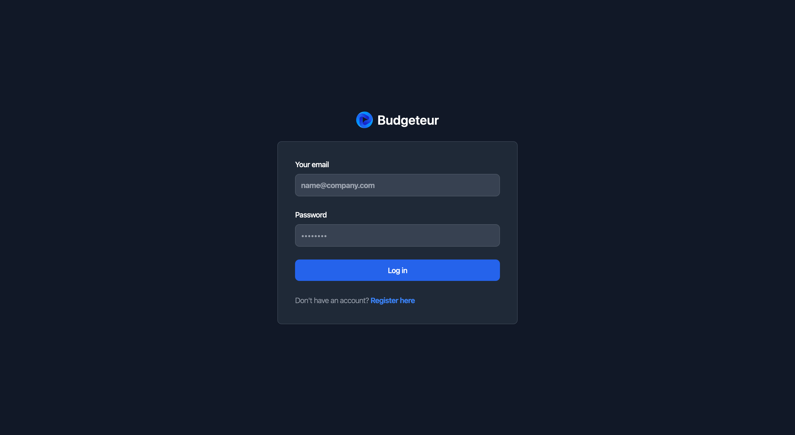

# Budgeteur-rs

Budgeteur is a budgeting and personal finance web-app.

This app aims to provide two services:

- Budgeting: Recording your income and expenses, and tracking savings targets.
- Personal Finance: Keeping track of your net worth.

The application consists of a single REST server that renders and serves HTML directly.

## Quick Start

This project was developed with cargo 1.8.0, other versions have not been tested.

1. (First time only) Run the below script to create the test database:

    ```shell
    cargo run --bin create_test_db -- --output-path test.db
    ```

2. To start the server run the following command:

    ```shell
    SECRET=YOUR_SECRET cargo run -- --db-path test.db --cert-path your/certs
    ```

    By default, this will serve on port 3000.

    If you want to automatically recompile and restart the server you can use
    the following command:

    ```shell
    cargo watch -E SECRET=YOUR_SECRET -x 'run -- --db-path test.db --cert-path your/certs'
    ```

    `--cert-path` should contain the files `cert.pem` and `key.pem`.
    If you do not have the required SSL certificates, you can generate your
    own [using OpenSSL](https://stackoverflow.com/a/10176685):

    ```shell
    openssl req -x509 -newkey rsa:4096 -keyout key.pem -out cert.pem \
    -sha256 -days 365 -nodes \
    -addext authorityKeyIdentifier=keyid,issuer \
    -addext basicConstraints=CA:FALSE
    ```

3. Test that the server is running:

    ```shell
    curl -i -X GET https://localhost:3000/coffee
    ```

    Example output:

    ```text
    HTTP/2 418
    content-length: 0
    date: Thu, 22 Aug 2024 03:00:58 GMT
    ```

## Nix Development Environment

If you have Nix installed, use `nix develop` while in the root directory to
create the development environment.
This creates a new shell environment with the packages declared in `flake.nix`.
Similar to a Docker image, this shell environment is isolated from your system
and enables easy, replicable development environments.

## Status and Next Steps

Currently, user registration, log in and log out have been implemented on both
the backend and frontend.





The next steps will be to work on CRUD functionality for transactions.
This will allow for the fundamental budgeting functionality.

## Docs

For now, you can view the docs by building them locally:

```shell
cargo doc --open
```

The flag `--open` will open the docs in your default web browser.

## API Design

### HTTP Status Codes

HTTP status codes are generally used in line with the standards that define
them.

2xx status codes indicate that the server understood and processed the
request without errors, and the client does not need to perform any special
handling of the response. Note that this means that things like invalid log-in
credentials or invalid emails in registrations forms will return with a HTTP
200 status code because these response will contain the error messages that
should be displayed directly to the user and there is no action the client can
or should take on the user's behalf to rectify these issues.

3xx status codes are used for full page redirects. In cases where the response
to a HTMX request requires a redirect, the corresponding HTMX redirect header
is used instead.

4xx status codes are used when the request could not be fulfilled due to
issues with the request. Common causes are requests for non-existent resources
or malformed forms (e.g., missing form fields). 4xx codes are not used to
indicate expected application errors (invalid log-in credentials).

5xx status codes are used when the request could not be fulfilled due to an
unexpected and unhandled error on the server.
