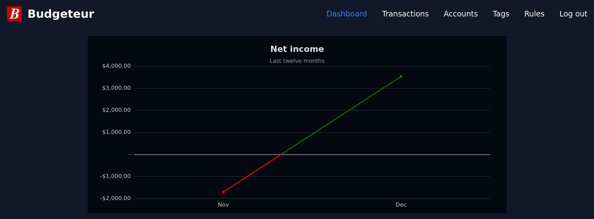

# Budgeteur

[](https://github.com/AnthonyDickson/budgeteur-rs/actions/workflows/ci.yml)
[](https://github.com/AnthonyDickson/budgeteur-rs/actions/workflows/release.yaml)

## About

Budgeteur is a budgeting and personal finance web-app.

This app aims to provide two services:

- Budgeting: Recording your income and expenses, and tracking savings targets.
- Personal Finance: Keeping track of your net worth.

This application is intended for a single user and to be self-hosted on a home server.



## Why?

I started budgeting with a phone app, but I quickly ran into three main issues:

1. it required me to enter my income/expenses manually,
1. it only worked on my phone,
1. and it didn't help me with tracking my net worth.

I have tried using a spreadsheet to track my net worth, however I then ran into issues where editing this spreadsheet
from multiple devices lead to old copies overwriting the copy in my cloud storage.

Budgeteur is my attempt at a single, cross-platform application for tracking my budget and net worth.
One helpful feature of Budgeteur is that you can import transactions and track your account balances from CSV files.
These CSV can be exported from the internet banking websites for New Zealand bank accounts (ASB and Kiwibank).
This reduces the amount manual data entry significantly, making it easier to maintain the habit of tracking your
budget even when life gets busy.

## Getting Started

This application is distributed as a Docker image and Docker Compose is the recommended way of running the app.

See [compose.yaml](./compose.yaml) for an example Docker compose file.

Once you have your `compose.yaml` set up, just run:

```shell
docker compose up
```

> [!CAUTION]
> The server uses HTTP which is not secure. It is highly recommended to put the
> server behind a reverse proxy such as Nginx to serve the application over
> HTTPS, especially if hosting this app on the public internet.

### First-Time Usage

Follow the instructions to [reset your password](#resetting-your-password).

### Resetting Your Password

On the computer running the server, run the following command:

```shell
docker compose -p budgeteur exec web reset_password --db-path /app/data/budgeteur.db
```

> [!TIP]
> Refer to your `compose.yaml` for the host mount path, database filename and/or image tag.

> [!TIP]
> The above command assumes the service is already running. If it is not running, replace `exec` with `run`.

The app only allows a single user and the following instructions will reset
the password for that sole user account.

## Dates and Timezones

The app will use, in order of priority, dates and times in:

1. the timezone specified in the CLI flags or
1. the local timezone as specified by the host operating system or
1. the UTC+00:00 timezone if the host operating system's local timezone cannot be determined.

The app will assume all dates and times from the web client use the timezone as determined above.
The CLI will accept canonical timezones as specified in <https://en.wikipedia.org/w/index.php?title=List_of_tz_database_time_zones&oldid=1309592143#List>,
e.g. "Pacific/Auckland".

## TUI Client

Budgeteur includes a terminal client (`budgeteur-tui`) that connects to the
server from a different machine over the network. It uses Ed25519-signed JWTs
for passwordless authentication.

### Installation

**Via Nix flakes:**

```shell
# Run directly
nix run github:AnthonyDickson/budgeteur-rs#budgeteur-tui -- --url http://server:3000

# Install permanently
nix profile install github:AnthonyDickson/budgeteur-rs#budgeteur-tui

# Pin to a specific release
nix run github:AnthonyDickson/budgeteur-rs/v0.31.0#budgeteur-tui
```

**For NixOS / home-manager users**, add to your flake inputs:

```nix
inputs.budgeteur.url = "github:AnthonyDickson/budgeteur-rs";
```

Then install via `home.packages` or `environment.systemPackages`:

```nix
inputs.budgeteur.packages.${system}.budgeteur-tui
```

**From a pre-built binary (Linux x86_64):**

Download `budgeteur-tui-linux-x86_64` from the [latest GitHub release](https://github.com/AnthonyDickson/budgeteur-rs/releases/latest), make it executable, and run:

```shell
chmod +x budgeteur-tui-linux-x86_64
./budgeteur-tui-linux-x86_64 --url http://server:3000
```

**From source:**

```shell
cargo build --release -p budgeteur_tui
```

### First-Time Setup

On the machine where you want to run the TUI:

```shell
budgeteur-tui init
```

This generates an Ed25519 keypair and prints the public key. Copy that key.

On the server machine, create `tui_public_keys.toml`:

```toml
[[keys]]
label = "laptop"
public_key = "<paste-the-public-key-here>"
```

Start the server with the key file:

```shell
budgeteur_rs --db-path /app/data/budgeteur.db --tui-public-keys-path tui_public_keys.toml
```

Or via Docker Compose, mount the file and add the CLI flag.

### Running

```shell
budgeteur-tui --url http://server-ip:3000
```

The server URL defaults to `http://localhost:3000`. You can also create a
config file at `~/.config/budgeteur/config.toml`:

```toml
server_url = "http://192.168.1.100:3000"
```

## Development

If you are interested in compiling and/or modifying the source code, see [DOCS.md](/DOCS.md).
